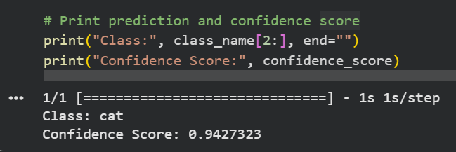

# Teachable-Machine-Project
Image Recognition using Google Teachable Machine, Tensorflow (keras),and Python

# Image Recognition using Google Teachable Machine

## Project Overview
This project demonstrates an image recognition model created using **Google Teachable Machine**. The model was trained to classify images into multiple classes and exported in **TensorFlow (Keras)** format. A Python script was used in **Google Colab** to load the model and predict the class of input images.

## Objectives
- Train an image classification model using Google Teachable Machine.
- Export the trained model in TensorFlow (Keras) format.
- Load the model using Python.
- Predict the class of input images.
- Evaluate the model's performance.

## Tools & Technologies
- Google Teachable Machine
- TensorFlow (Keras)
- Python
- Google Colab
- GitHub

## Project Files
```
├── keras_model/          # Exported TensorFlow (Keras) model
├── labels.txt            # Class labels
├── predict.py            # Python script for image prediction
├── output.png            # Screenshot of prediction result
└── README.md             # Project documentation
```

## How to Run
1. Download or clone this repository.
2. Open the Python script in Google Colab or any Python environment.
3. Load the exported Keras model.
4. Select an input image.
5. Run the script to display the predicted class and confidence score.

## Results
The trained model successfully classifies input images into the trained classes and displays the predicted label along with the confidence percentage.

## Output Screenshot



## Author
**Ghaith**  
Information Technology Student  
Interested in Robotics, Artificial Intelligence, and Programming.
